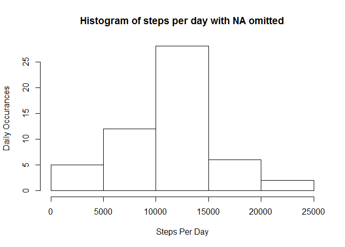
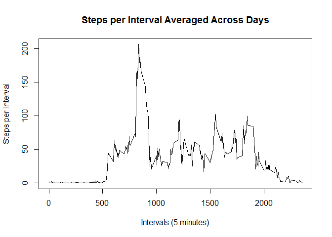
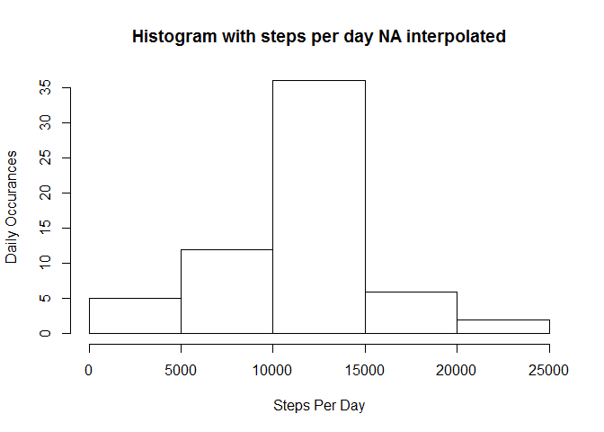
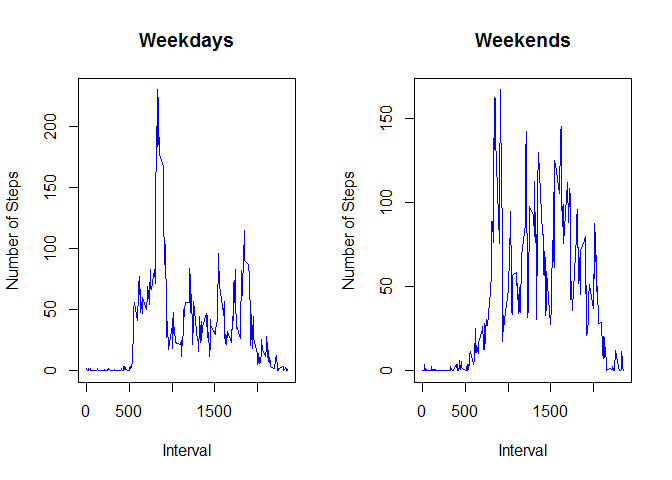

# Coursera Reproducible Research Assignment 1


## Dave Kuntz


###Loading and preprocessing the data

1. First, activity monitoring data is loaded into R by using the read.csv command.


```r
data <- read.csv('activity.csv', header = TRUE)
```

2. Then, rows containing NA values are removed.  The original "data" data frame is kept separate for future use.

```r
data_noNA <- data[complete.cases(data),]
```
&nbsp;


###What is mean total number of steps taken per day?
1. The total number of steps taken per day is calculated via the tapply function with date as a factor.  The data with NA omitted was used.


```r
steps_per_day <- tapply(data_noNA$steps,data_noNA$date,sum)
```

2. The histogram is created of steps per day.


```r
hist(steps_per_day, xlab="Steps Per Day", ylab = "Daily Occurances", main="Histogram of steps per day with NA omitted")
```

<!-- -->

3. The mean and median are calculated and shown below.

```r
mean(steps_per_day[-which(is.na(steps_per_day))])
```

```
## [1] 10766.19
```

```r
median(steps_per_day[-which(is.na(steps_per_day))])
```

```
## [1] 10765
```
&nbsp;

###What is the average daily activity pattern?
1. The steps per five-minute interval, as averaged across all days with missing values removed, is calculated using tapply and then line plotted, showing how more walking occurs mid-day.


```r
steps_per_interval <- tapply(data_noNA$steps,data_noNA$interval,mean)

plot(names(steps_per_interval),steps_per_interval, type="l", xlab="Intervals (5 minutes)", ylab = "Steps per Interval", main="Steps per Interval Averaged Across Days")
```

<!-- -->
&nbsp;

2. The interval with maximum steps is calculated by matching it to the maximum number of steps in an interval.  It occurs at interval 835 with about 206 steps.


```r
steps_per_interval[steps_per_interval == max(steps_per_interval)]
```

```
##      835 
## 206.1698
```

&nbsp;

###Imputing missing values
1. The number of total missing values in the dataset was calculated using the sum function.

```r
sum(is.na(data$steps))
```

```
## [1] 2304
```
2. Missing values in the dataset are filled in my replacing them with the mean for the time interval in which they were used across all days.

```r
#Loop to fill in missing NA values with average for same interval
for (n in 1:nrow(data)){
  data$steps[n][is.na(data$steps[n])] <- mean(data$steps[data$interval == data$interval[n]], na.rm = TRUE)
}
```

3. The completed data set is divided by date, similar to the data with NA values removed.


```r
steps_per_day_interpolated <- tapply(data$steps,data$date,sum)
```

4. A histogram is created.  It is very similar in appearance to the histogram with NA values ommitted but contains higher steps overall.

```r
hist(steps_per_day_interpolated, xlab="Steps Per Day", ylab = "Daily Occurances", main = "Histogram with steps per day NA interpolated")
```

<!-- -->

The mean and median are calculated from the dataset with missing values interpolated.

```r
mean(steps_per_day_interpolated)
```

```
## [1] 10766.19
```

```r
median(steps_per_day_interpolated)
```

```
## [1] 10766.19
```
Both mean and median values were the same.  They were roughly identical to the mean and median values of the dataset with NA values omitted, varying by less than a few steps.

&nbsp;

###Are there differences in activity patterns between weekdays and weekends?
1. A new factor variable is created to distinguish between weekends and weekdays.  Data with NA values interpolated is used.

```r
weekdays1 <- c('Monday', 'Tuesday', 'Wednesday', 'Thursday', 'Friday')
data$wkdys <- factor((weekdays(as.Date(data$date)) %in% weekdays1), 
                   levels=c(FALSE, TRUE), labels=c('weekend', 'weekday'))
```
2. Plots are made of both weekend and weekday step intervals.


```r
#Make multicolumn plot
par(mfcol = c(1,2))

#Split by both weekend/weekday and interval
wkndwkdy <- tapply(data$steps,list(data$wkdys,data$interval),mean)

#Plot weekdays
plot(names(wkndwkdy[2,]),wkndwkdy[2,],type="l", main = "Weekdays", xlab="Interval", ylab = "Number of Steps", col="blue")

#Plot weekends
plot(names(wkndwkdy[1,]),wkndwkdy[1,],type="l", main = "Weekends", xlab="Interval", ylab = "Number of Steps", col="blue")
```

<!-- -->
&nbsp;

There were some differences between weekends and weekdays.  Weekdays tended to have more maximum steps in an interval but weekends had steps spread out more throughout the day.
